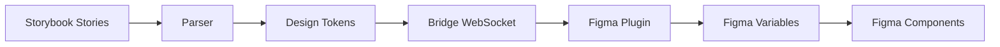

# Figma Story Plugin - Setup Documentation

## Overview

This document details the initial setup and architecture of the Figma Story Plugin monorepo. This setup was completed as part of the initial project scaffolding to create a solid foundation for development.

## Project Structure

The project is organized as a pnpm monorepo with the following structure:

```
figma-story-plugin/
├── packages/
│   ├── shared/              # Shared types and utilities
│   ├── parser/              # Token parsing and analysis (PostCSS, Babel)
│   ├── bridge/              # WebSocket communication layer
│   ├── storybook-addon/     # Storybook addon for token extraction
│   └── figma-plugin/        # Figma plugin for variable creation
├── docs/                    # Documentation
├── examples/                # Example implementations
├── package.json             # Root workspace configuration
├── pnpm-workspace.yaml      # pnpm workspace definition
├── tsconfig.json            # Root TypeScript configuration
├── .eslintrc.json           # ESLint configuration
├── .prettierrc              # Prettier configuration
└── .gitignore               # Git ignore rules
```

## Technology Stack

### Core Technologies
- **TypeScript 5.3+**: All packages use TypeScript for type safety
- **pnpm 8+**: Workspace management and efficient dependency handling
- **React 18**: UI components for Storybook addon
- **Node.js 18+**: Runtime environment

### Package-Specific Dependencies

#### @figma-story-plugin/shared
- Core types and utilities shared across all packages
- No external dependencies (keeps it lightweight)

#### @figma-story-plugin/parser
- **@babel/parser**: JavaScript/TypeScript AST parsing
- **@babel/traverse**: AST traversal and analysis
- **postcss**: CSS parsing and analysis
- **postcss-value-parser**: CSS value parsing

#### @figma-story-plugin/bridge
- **ws**: WebSocket implementation for real-time communication
- Handles communication between Storybook addon and Figma plugin

#### @figma-story-plugin/storybook-addon
- **@storybook/addon-kit**: Storybook addon development tools
- **@storybook/api**: Storybook API integration
- **React**: UI components for the addon panel

#### @figma-story-plugin/figma-plugin
- **@figma/plugin-typings**: Figma Plugin API types
- Standalone plugin that connects to the bridge

## Development Workflow

### Getting Started

1. **Install dependencies:**
   ```bash
   pnpm install
   ```

2. **Development mode:**
   ```bash
   pnpm dev  # Starts all packages in watch mode
   ```

3. **Build all packages:**
   ```bash
   pnpm build
   ```

4. **Run tests:**
   ```bash
   pnpm test
   ```

5. **Linting and type checking:**
   ```bash
   pnpm lint
   pnpm typecheck
   ```

### Package Scripts

Each package includes standard scripts:
- `dev`: Development mode with watch
- `build`: Production build
- `clean`: Remove build artifacts
- `typecheck`: TypeScript type checking
- `test`: Run tests (where applicable)

## Architecture Overview

### Communication Flow



### Key Components

1. **Token Parser** (`packages/parser/`)
   - Extracts design tokens from CSS variables and JavaScript objects
   - Uses PostCSS for CSS analysis and Babel for JS/TS AST parsing
   - Converts tokens to standardized format

2. **WebSocket Bridge** (`packages/bridge/`)
   - Provides real-time communication between Storybook and Figma
   - Handles message queuing and error recovery
   - Manages multiple client connections

3. **Storybook Addon** (`packages/storybook-addon/`)
   - Integrates with Storybook UI
   - Provides token extraction and sync controls
   - Real-time status updates

4. **Figma Plugin** (`packages/figma-plugin/`)
   - Creates and manages Figma variables
   - Generates components with variable bindings
   - Handles bidirectional synchronization

5. **Shared Types** (`packages/shared/`)
   - Common TypeScript interfaces
   - Utility functions
   - Message protocols

## Configuration

### TypeScript Configuration

- Root `tsconfig.json` provides shared compiler options
- Each package extends the root configuration
- Path mapping configured for internal package imports

### ESLint & Prettier

- Consistent code style across all packages
- TypeScript-aware linting rules
- Automatic formatting on save (recommended)

### pnpm Workspaces

- All packages are linked internally using `workspace:*` protocol
- Efficient dependency sharing
- Parallel build and test execution

## Next Steps

### Phase 1 Implementation Priorities

1. **Token Parser Implementation**
   - CSS variable detection and extraction
   - JavaScript token object parsing
   - Token validation and type inference

2. **WebSocket Bridge Development**
   - Real-time communication protocol
   - Error handling and reconnection logic
   - Message queuing system

3. **Figma Plugin Core Features**
   - Variable creation API integration
   - Component generation logic
   - Theme/mode management

4. **Storybook Addon UI**
   - Token extraction interface
   - Sync status dashboard
   - Configuration panel

### Development Guidelines

- Always run `pnpm typecheck` before commits
- Write tests for new functionality
- Update documentation for API changes
- Use semantic versioning for releases

### Testing Strategy

- Unit tests for parser logic
- Integration tests for WebSocket communication
- E2E tests for full sync workflow
- Manual testing with real design systems

## Troubleshooting

### Common Issues

1. **Build Failures**
   - Ensure all dependencies are installed: `pnpm install`
   - Clean and rebuild: `pnpm clean && pnpm build`

2. **TypeScript Errors**
   - Check path mappings in `tsconfig.json`
   - Verify workspace dependencies are correctly linked

3. **WebSocket Connection Issues**
   - Check port availability (default: 8080)
   - Verify firewall settings
   - Check browser console for connection errors

### Performance Considerations

- Parser should handle large codebases efficiently
- WebSocket connections should be optimized for real-time updates
- Figma API calls should be batched to avoid rate limits
- Memory usage should be monitored in development

## Contributing

1. Follow the established TypeScript and ESLint configuration
2. Add tests for new features
3. Update documentation for API changes
4. Use conventional commit messages
5. Ensure all CI checks pass before merging

---

This setup provides a solid foundation for developing the revolutionary Storybook-to-Figma synchronization tool. The monorepo architecture allows for independent development of each component while maintaining consistency across the entire project.