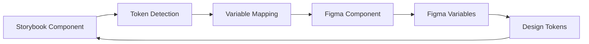

# Storybook to Figma Variables - Product Development Plan

## Executive Summary

Building a next-generation Storybook-to-Figma synchronization tool that preserves design tokens as Figma variables, enabling true design-code parity. This product will be the first to maintain semantic token relationships rather than converting to static values.

**Unique Value Proposition**: "Don't just sync components - preserve your design decisions"

## Market Analysis

### Current Landscape

| Product | Price | Strengths | Weaknesses |
|---------|-------|-----------|------------|
| story.to.design | $149/month | Visual accuracy, auto-layout, pseudo-states | No variable support, one-way sync, expensive |
| storybook-to-figma (OSS) | Free | Open source, basic HTML conversion | Beta quality, no variable support, limited CSS |
| Figma Dev Mode | $35/month/seat | Official Figma solution | Requires manual setup, no Storybook integration |

### Market Opportunity
- **TAM**: 50,000+ companies using design systems
- **Pain Point**: 73% report design-code drift as major issue (2024 Design Systems Survey)
- **Willingness to Pay**: Teams currently paying $149/month for inferior solutions

## Product Vision

### Core Innovation: Variable-First Architecture



### Key Differentiators

1. **Bidirectional Token Sync**
   - Code tokens → Figma variables (not static values)
   - Figma variable changes → Update code tokens

2. **Semantic Preservation**
   - `theme.color.primary` → `Brand/Primary` variable
   - Maintains relationships and inheritance

3. **Multi-Theme Intelligence**
   - Themes become Figma modes automatically
   - Switch brands without regenerating components

4. **Developer-First Approach**
   - CLI tool for CI/CD integration
   - Git-based version control for designs
   - Automated PR generation

## Technical Architecture

### System Components

```
┌─────────────────────────────────────────────────┐
│                 Browser Runtime                  │
├─────────────────┬───────────────────────────────┤
│  Storybook      │         Figma                 │
│  Addon          │         Plugin                │
├─────────────────┴───────────────────────────────┤
│                WebSocket Bridge                  │
├──────────────────────────────────────────────────┤
│              Token Parser Service                │
├──────────────────────────────────────────────────┤
│           Variable Mapping Engine                │
├──────────────────────────────────────────────────┤
│              Figma API Client                    │
└──────────────────────────────────────────────────┘
```

### Core Technologies

- **Frontend**: TypeScript, React (Storybook addon)
- **Figma Plugin**: TypeScript, Figma Plugin API
- **Parser**: PostCSS for CSS analysis, Babel for JS/TS AST
- **Communication**: WebSocket for real-time sync
- **Backend** (Phase 2): Node.js, PostgreSQL for team features

### Data Flow

1. **Token Extraction**
   ```typescript
   // Input: React component
   <Button style={{ color: theme.color.primary }}>
   
   // AST Analysis extracts:
   { 
     property: 'color',
     token: 'theme.color.primary',
     fallback: '#a8242f'
   }
   ```

2. **Variable Mapping**
   ```typescript
   // Token to Figma variable mapping
   {
     'theme.color.primary': 'VariableID:1:2',
     'theme.spacing.md': 'VariableID:1:3'
   }
   ```

3. **Component Generation**
   ```typescript
   // Figma component with variables
   {
     fills: [{ 
       type: 'SOLID',
       boundVariables: {
         color: { id: 'VariableID:1:2' }
       }
     }]
   }
   ```

## Development Roadmap

### Phase 1: MVP (Weeks 1-6)
**Goal**: Prove variable preservation concept

#### Week 1-2: Foundation
- [ ] Repository setup with monorepo structure
- [ ] Basic Figma plugin scaffold
- [ ] Storybook addon boilerplate
- [ ] WebSocket communication layer

#### Week 3-4: Core Features
- [ ] CSS variable detection in Storybook
- [ ] Token to Figma variable mapping
- [ ] Basic component import with variables
- [ ] Support for color variables only

#### Week 5-6: Polish & Testing
- [ ] Test with 3 themes (eboks, nykredit, postnl)
- [ ] Error handling and edge cases
- [ ] Basic UI for plugin and addon
- [ ] Documentation and setup guide

**Deliverable**: Working prototype that imports Button component with color variables

### Phase 2: Enhanced Conversion (Weeks 7-12)
**Goal**: Achieve feature parity with story.to.design

#### Week 7-8: Layout Intelligence
- [ ] Auto-layout detection algorithm
- [ ] Flexbox/Grid to Figma constraints
- [ ] Spacing token support
- [ ] Responsive variant generation

#### Week 9-10: Advanced Variables
- [ ] Typography variables (font-size, font-family)
- [ ] Effect variables (shadows, blur)
- [ ] Numeric variables (border-radius, spacing)
- [ ] Variable inheritance and aliases

#### Week 11-12: Component Intelligence
- [ ] Prop to variant mapping
- [ ] State detection (hover, active, focus)
- [ ] Nested component support
- [ ] Component instance swapping

**Deliverable**: Full component library import with all variable types

### Phase 3: Bidirectional Sync (Weeks 13-20)
**Goal**: Enable true design-code parity

#### Week 13-15: Figma to Code
- [ ] Figma webhook integration
- [ ] Variable change detection
- [ ] Token file generation
- [ ] Git integration for automated commits

#### Week 16-18: Conflict Resolution
- [ ] Change diff visualization
- [ ] Merge conflict UI
- [ ] Rollback mechanism
- [ ] Change approval workflow

#### Week 19-20: Team Features
- [ ] Multi-user sync coordination
- [ ] Change history and audit log
- [ ] Branch-based design versions
- [ ] Comments and annotations sync

**Deliverable**: Full bidirectional sync with version control

### Phase 4: Scale & Intelligence (Weeks 21-26)
**Goal**: Enterprise-ready features

#### Week 21-23: Analytics & Insights
- [ ] Component usage tracking
- [ ] Token adoption metrics
- [ ] Design drift detection
- [ ] Consistency scoring

#### Week 24-26: Enterprise Features
- [ ] SSO integration
- [ ] Custom token transformers
- [ ] CI/CD pipeline integration
- [ ] Self-hosted deployment option

**Deliverable**: Enterprise-ready product with analytics

## Go-to-Market Strategy

### Pricing Tiers

| Tier | Price | Features | Target |
|------|-------|----------|---------|
| **Free** | $0 | 10 components/month, 1 theme, community support | Individual designers |
| **Pro** | $29/month | Unlimited components, 3 themes, email support | Small teams |
| **Team** | $79/month | Everything in Pro + bidirectional sync, analytics, Slack support | Growing teams |
| **Enterprise** | Custom | Self-hosted, SSO, SLA, dedicated support | Large organizations |

### Launch Strategy

#### Pre-Launch (Month 1)
1. **Landing Page**: Create waitlist at figma-variables.dev
2. **Content Marketing**: 
   - "Why Design Tokens Matter" blog series
   - "The Hidden Cost of Design-Code Drift" whitepaper
3. **Community Building**:
   - Discord server for early adopters
   - Weekly design system office hours

#### Beta Launch (Month 2)
1. **Private Beta**: 50 hand-picked design system teams
2. **Feedback Loops**: Weekly user interviews
3. **Case Studies**: Document 3 success stories
4. **Influencer Outreach**: Partner with design system advocates

#### Public Launch (Month 3)
1. **Product Hunt**: Coordinate launch with community
2. **Figma Community**: Publish free plugin version
3. **Conference Circuit**: Submit talks to Config, Clarity, SmashingConf
4. **Partnership**: Approach Figma for official partnership

### Marketing Channels

1. **Organic**
   - SEO-optimized documentation site
   - YouTube tutorials and demos
   - Design system newsletter sponsorships

2. **Paid**
   - Google Ads for "storybook figma" keywords
   - LinkedIn ads targeting design system managers
   - Sponsorship of design system podcasts

3. **Community**
   - Active participation in Design Systems Slack
   - Regular contributions to design system repos
   - Speaking at local meetups

## Success Metrics

### Phase 1 (MVP)
- [ ] 100 plugin installs
- [ ] 10 active beta users
- [ ] 3 completed case studies
- [ ] Working demo video

### Phase 2 (6 months)
- [ ] 1,000 active users
- [ ] 50 paying customers
- [ ] $5,000 MRR
- [ ] 4.5+ Figma plugin rating

### Phase 3 (12 months)
- [ ] 5,000 active users
- [ ] 500 paying customers
- [ ] $50,000 MRR
- [ ] 2 enterprise contracts

### Phase 4 (24 months)
- [ ] 20,000 active users
- [ ] 2,000 paying customers
- [ ] $200,000 MRR
- [ ] Acquisition discussions

## Risk Analysis

### Technical Risks

| Risk | Probability | Impact | Mitigation |
|------|------------|--------|------------|
| Figma API changes | Medium | High | Abstract API layer, maintain compatibility layer |
| Performance issues with large systems | High | Medium | Implement pagination, lazy loading, caching |
| Variable mapping complexity | Medium | High | Start with simple mappings, iterate based on feedback |

### Business Risks

| Risk | Probability | Impact | Mitigation |
|------|------------|--------|------------|
| story.to.design adds variable support | Medium | High | Move faster, focus on bidirectional sync |
| Figma builds native solution | Low | Critical | Partner with Figma, focus on Storybook integration |
| Slow adoption | Medium | Medium | Free tier, extensive documentation, community building |

## Resource Requirements

### Team (MVP)
- **You**: Product, development, design
- **Contract Developer** (optional): $5,000 for Phase 1 help
- **Designer** (optional): $2,000 for landing page and UI

### Infrastructure
- **Development**: $0 (local development)
- **Hosting** (Phase 2): $100/month (Vercel, Supabase)
- **Domain**: $20/year (figma-variables.dev)
- **Figma License**: $15/month (Professional plan)

### Total MVP Budget
- **Minimum**: $35 (domain + Figma)
- **Recommended**: $7,000 (includes contractors)

## Implementation Checklist

### Week 1: Setup
- [ ] Create GitHub repository
- [ ] Set up monorepo with pnpm workspaces
- [ ] Initialize Figma plugin project
- [ ] Initialize Storybook addon project
- [ ] Set up TypeScript and ESLint
- [ ] Create basic documentation structure

### Week 2: Core Development
- [ ] Implement token parser
- [ ] Create variable mapping logic
- [ ] Build Figma plugin UI
- [ ] Build Storybook addon panel
- [ ] Establish WebSocket communication

### Week 3: Integration
- [ ] Connect Storybook to parser
- [ ] Implement Figma variable creation
- [ ] Add component import flow
- [ ] Handle error states
- [ ] Add loading states

### Week 4: Testing
- [ ] Test with eboks theme
- [ ] Test with nykredit theme
- [ ] Test with postnl theme
- [ ] Fix edge cases
- [ ] Performance optimization

### Week 5: Polish
- [ ] Improve UI/UX
- [ ] Write user documentation
- [ ] Create demo video
- [ ] Set up landing page
- [ ] Prepare beta launch

### Week 6: Launch
- [ ] Deploy to production
- [ ] Publish to Figma Community (draft)
- [ ] Launch on Product Hunt
- [ ] Share in communities
- [ ] Begin user interviews

## Validation Milestones

Before proceeding to each phase, validate:

### Before Phase 1
- [ ] 50+ people on waitlist
- [ ] 5 design system teams interested
- [ ] Figma plugin approval process understood

### Before Phase 2
- [ ] 10 active beta users
- [ ] Positive feedback on variable preservation
- [ ] Clear feature requests prioritized

### Before Phase 3
- [ ] 3 paying customers committed
- [ ] Technical feasibility proven
- [ ] Figma partnership discussions started

### Before Phase 4
- [ ] $10,000 MRR achieved
- [ ] 90% customer retention
- [ ] Clear enterprise demand

## Success Criteria

The project is successful if:
1. **Technical**: Variable preservation works reliably
2. **Product**: Users prefer this over story.to.design
3. **Business**: Achieves $50,000 MRR within 12 months
4. **Strategic**: Becomes the standard for token-based design systems

## Next Steps

1. **Today**: Share this plan with 3 potential users for feedback
2. **This Week**: Create landing page and start waitlist
3. **Next Week**: Begin MVP development
4. **Month 1**: Launch private beta
5. **Month 3**: Public launch

---

*"The best design systems don't just share components - they preserve design decisions."*

**Start building the future of design-code synchronization today.**